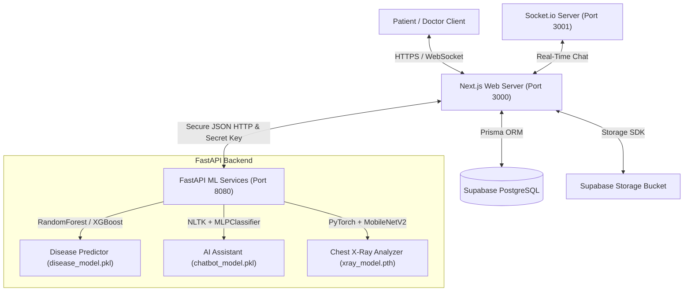

# MedAI — Smart Health Consultation Platform

MedAI is a comprehensive full-stack healthcare application designed to merge advanced machine learning diagnostics with streamlined clinical workflows. It provides patients with instant, highly accurate symptom analysis, an intelligent conversational medical assistant, and a seamless portal to initiate real-time consultations with medical professionals. For doctors, MedAI offers a clinical workstation containing patient queues, real-time consultation rooms with integrated chat, medical report upload and review pipelines, and an automated PyTorch CNN assistant that pre-screens chest X-rays.

The platform is designed with a dual-service architecture. The Next.js 14 frontend acts as the user interface, database gateway, and web broker, handling secure user authentication, Google Places integration for facility lookup, and file storage. The FastAPI backend services handle core machine learning tasks, including disease prediction inference, intent-based chat classification, and chest X-ray image analysis using deep neural networks.

---

## 🏗️ System Architecture

The following diagram illustrates the data flow and communication layout between the Next.js web application, the FastAPI machine learning backend, and Supabase services:



---

## 🛠️ Technology Stack

| Layer | Technologies | Purpose |
|---|---|---|
| **Frontend & UI** | Next.js 14 (App Router), TypeScript, Tailwind CSS, shadcn/ui | Main user interface, role-based pages, dashboards |
| **Databases** | Supabase (PostgreSQL), Prisma ORM | Relational data persistence, authentication accounts, logs |
| **Real-time Engine** | Socket.io (Node.js custom wrapper) | Peer-to-peer real-time communication for doctor consultation |
| **Storage** | Supabase Storage (private bucket) | Secure medical file upload and signed URL hosting |
| **ML Backend** | FastAPI, Python 3.13, Uvicorn | Microservices API for hosting ML models and running inference |
| **Machine Learning** | PyTorch, scikit-learn, NLTK, pandas, numpy | Disease prediction, intent classification, CNN X-ray analysis |

---

## 🌟 Key Features

1. **AI Disease Predictor:** Select from 132 symptoms in a multi-select dropdown. Next.js proxies symptoms to FastAPI, which feeds a Random Forest classifier. Returns top 3 potential diseases with confidence scores. If confidence is below 60%, recommends a metabolic blood panel.
2. **AI Health Assistant:** Intent-based chatbot trained using NLTK stemming and a multilayer perceptron classifier on a curated medical dataset of 60+ intents. Fallbacks are triggered for confidence levels below 75%.
3. **Doctor Workspace & Waiting Room:** Queue management system showing waiting patients with their symptom checks. Doctors accept patients to enter active consultation rooms.
4. **Real-time Consultation Chat:** Fully integrated Socket.io chat room linked by consultation session ID. Saves message history to the database.
5. **Prescription PDF Generation:** Interactive textarea for doctors to issue prescriptions, complete consultation sessions, and allow patients to export prescription PDFs.
6. **Chest X-Ray Pre-Screening:** Patients upload medical X-rays. A MobileNetV2 CNN classifier trained in PyTorch flags potential Pneumonia (ImageNet normalizations: mean `[0.485, 0.456, 0.406]`, std `[0.229, 0.224, 0.225]`).
7. **Facility Finder:** Leverages Google Places API (with local simulated fallback) to search for nearby hospitals, clinics, and pharmacies based on browser geolocation.
8. **Admin Panel:** Intent manager to edit chatbot templates, promote/demote user roles, approve pending doctor registrations, and trigger model retraining.

---

## 🚀 Local Setup Instructions

### Prerequisites
- Node.js (v18 or higher)
- Python (v3.10 or higher)
- Supabase Project & PostgreSQL database

### 1. Database Setup (Supabase)
Create a Supabase project and get your Connection String. Define it in `frontend/.env` as `DATABASE_URL`.

### 2. Frontend Installation & Generation
```bash
cd frontend
npm install
npx prisma generate
npx prisma db push
```

### 3. FastAPI Python Backend Setup
```bash
cd fastapi
python -m venv venv
# On Windows PowerShell:
.\venv\Scripts\activate
# On Linux/macOS:
source venv/bin/activate

pip install -r requirements.txt
# Alternatively, install key packages:
pip install fastapi uvicorn pydantic python-multipart scikit-learn pandas numpy pillow torch torchvision nltk
```

### 4. Running the Application
Open three separate terminals to start the servers:

- **Terminal 1: Next.js Frontend Dev Server**
  ```bash
  cd frontend
  npm run dev
  ```
  App runs on `http://localhost:3000`.

- **Terminal 2: Socket.io Chat Server**
  ```bash
  cd frontend
  npm run socket
  ```
  Runs on `http://localhost:3001`.

- **Terminal 3: FastAPI Machine Learning Server**
  ```bash
  cd fastapi
  # Activate venv first
  .\venv\Scripts\activate
  uvicorn main:app --reload --port 8080
  ```
  FastAPI runs on `http://localhost:8080`.
